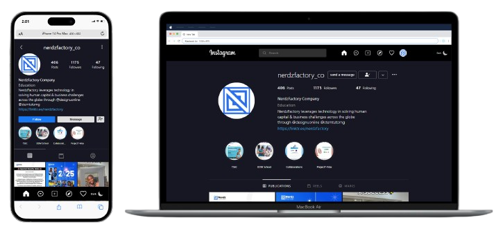

# Instagram Profile Page Clone



This project is a responsive and interactive clone of an Instagram profile page, built using React with Vite. The application mimics the layout and functionality of a typical Instagram profile.

## Features

-   Responsive design that adapts to various screen sizes
-   Interactive components for user engagement
-   Modern UI/UX similar to Instagram's profile layout
-   UI mockups designed in Figma: [View Figma Design](<https://www.figma.com/design/kGNNvR1obiVDEEY5XC4vuo/Free-Instagram-UI-Mockups-2023-(Community)?node-id=2-656&node-type=symbol&t=iAR2OjnlvqVjn452-0>)

## Technologies Used

-   React
-   Vite
-   CSS (or styled-components)
-   JavaScript

## Getting Started

Follow these instructions to set up the project locally.

### Prerequisites

Make sure you have the following installed:

-   Node.js (version 12 or later)
-   npm (comes with Node.js)

### Installation

1. Clone the repository:

    ```bash
    git clone https://github.com/CJay-Cipher/Instagram-Clone-Group-1-project-48-53.git
    ```

2. Navigate into the project directory:

    ```bash
    cd Instagram-Clone-Group-1-project-48-53/instagram_clone
    ```

3. Install the dependencies:
    ```bash
    npm install
    ```

### Running the Application

To start the development server, run:

```bash
npm run dev
```

Your application will be available at `http://localhost:5173` in your web browser.

## Usage

Explore the interactive features of the cloned Instagram profile page. You can view photos, follow users, and more.

## Collaborators

-   Lawal Rashidat Oyinkansola (060)
-   Shittu Kehinde Hajara (103)
-   Nwobi Chidubem Valentine (066)
-   Chijioke Nnabueze CJay (064)

## Note

The application can fetch Instagram content based on the specified username. For example, set the username as follows:

```bash
// App.jsx
const instagramUserName = "nerdzfactory_co";
```
